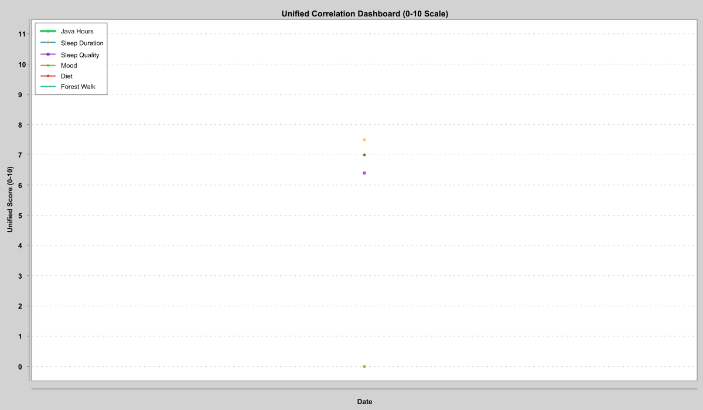

# PROJECT AMALA: N-of-1 Survival Experiment

> **Status:** 🟢 ACTIVE
> **Goal:** Java Software Engineer Offer
> **Target:** 1000 Hours of Deep Work

---

## 📊 TELEMETRY

| Metric | Value |
| :--- | :--- |
| **Total Java Hours** | **3,0** / 1000 |
| **Days Active** | 3 |
| **Last Sync** | 2025-12-18 02:00 |
| **System Version** | 0.01 (Genesis) |

---

## 📈 UNIFIED CORRELATION DASHBOARD

*Metrics are normalized to a unified 0-10 scale for correlation analysis. The **Gold Line** indicates the daily target (6.0h Java), while the **thick green line** tracks performance. Other lines represent key biometric and lifestyle inputs.*

---

## 📂 DATA ARCHIVE

This project adheres to **Open Science** principles.

*   📥 Download Full Dataset (CSV) <https://github.com/keebrunner/amala-n1-experiment01/blob/main/amala_dataset.csv> — Raw, unaltered scientific data for future analysis.

### [Daily Logs](Logs/)
- [**2025-12-17**](Logs/2025-12-17.md) — Java: `1,0h` | Mood: `6` | Diet: `5`
**Type:** `WORK` | **Java:** `1,0h` | **Mood:** `6` | **Diet:** `5` | **Sleep:** `7,1h` (64%) | **Forest:** `0m`

# Telemetry & Insights
It seems like the cold is my best friend. The time right after a cold morning shower is the happiest part of my day. Even though every session feels like walking to the scaffold. Although I’m a strong believer in viewing the entire organism holistically—feelings and consciousness as an integrated structure, in the paradigm of Michael Levin and Hinduism—it’s still important to understand the mechanics of my own neurotransmitters. Probably, my neurotransmitters are so suppressed by derealization (caused by insula damage from a perinatal stroke linked to cerebral palsy, plus psychological trauma) that only a kind of “defibrillation”—3.5 minutes under ice-cold water—can bring them anywhere close to normal. This has been really noticeable over the last two days when I’ve skipped the cold shower due to low energy.
But what’s also surprising is that cold exposure helps me in the evening to climb out of the toxic cortisol swamp. Empirically, I’ve realized that almost all the time I actually feel like myself, I’m trapped in a passive cortisol cage—and that’s devastating for memory and for the ability to learn in general. From what I figured out today: instead of actual studying (which for me is a form of avoidance), it’s phasic cortisol (triggered by making a mistake while solving a problem) + norepinephrine that burns new tags into neurons and promotes learning. On the other hand, tonic/phasic cortisol without norepinephrine (freeze response, rumination, getting stuck on a problem) directly kills memory neurons in the hippocampus and overall destroys neural connections while washing away importance markers.
Box breathing doesn’t help me shake off evening anxiety. Yoga nidra is more likely harmful because of my disrupted brain-body connection. I’m afraid to practice mindfulness due to my tendency toward derealization and the scare I got after an out-of-body attempt during Dr. Spiegel’s self-hypnosis. That raises a question worth exploring: how dangerous or beneficial mindfulness actually is for me when I already have baseline derealization—though not with the “observer” effect, more like a “fugitive” one.
Anyway. The only thing that reliably lowers cortisol and heart rate in a bottom-up physiological way is dunking my face in cold water with short breath holds (can’t do long ones because of cerebral atherosclerosis and hydrocephalus). I’ve been trying this for the second day now, combined with a hot shower after dinner.

---

- [**2025-12-16**](Logs/2025-12-16.md) — Java: `2,0h` | Mood: `7` | Diet: `5`
**Type:** `WORK` | **Java:** `2,0h` | **Mood:** `7` | **Diet:** `5` | **Sleep:** `9,2h` (81%) | **Forest:** `0m`

# Telemetry & Insights
It's like learning to walk all over again.

---

- [**2025-12-15**](Logs/2025-12-15.md) — Java: `0,0h` | Mood: `7` | Diet: `7`
**Type:** `REST` | **Java:** `0,0h` | **Mood:** `7` | **Diet:** `7` | **Sleep:** `7,5h` (64%) | **Forest:** `0m`

# Telemetry & Insights
Let's see what happens.

---

[→ **View Archive**](Logs/index.md)

---

### 🧬 PROTOCOL (Brief)
1.  **Morning:** PFC Activation (Java Hardcore).
2.  **Day:** Forest Walk + DMN Processing.
3.  **Evening:** Recovery & Logging.